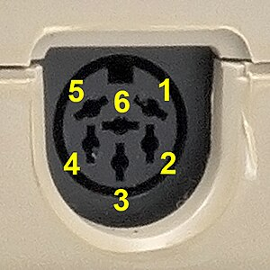
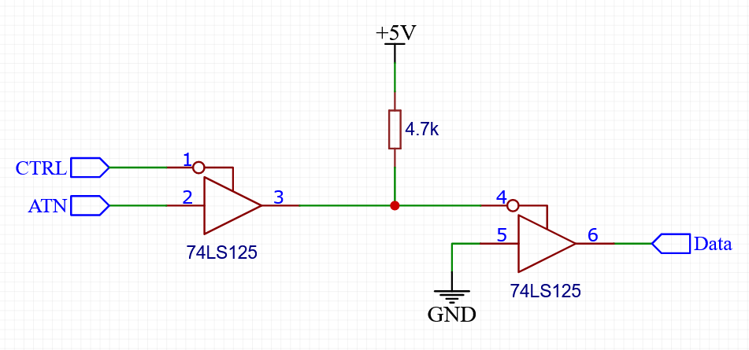

# IECDevice

This library for the Arduino IDE provides a simple interface to connect a variety of current 
microcontrollers to the Commodre IEC bus used on the C64, C128 and VIC-20. This should
make it easier for hobbyists to create new devices for those computers.

The library provides two classes:
  - ```IECDevice``` for creating low-level bus devices that directly respond to the data 
    sent over the bus one byte at a time. This can be used to implement devices such as
    [printers](examples/IECCentronics) or [modem-like](examples/IECBasicSerial) devices.
  - ```IECFileDevice``` for creating higher-level devices that operate more like disk
    drives. The IECFileDevice interface is file-based, providing open/close/read/write functions.
    An example use for this class would be an [SD-card reader](examples/IECSD).
    Any device created using this class automatically supports the [JiffyDos](#jiffydos-support) protocol for fast data transfers.

 So far I have tested this library on the following microcontrollers:
  -  8-bit ATMega devices (Arduino Uno, Mega, Mini, Micro, Leonardo)
  -  Arduino Due (32-bit)
  -  ESP32
  -  Raspberry Pi Pico

A number of examples are included to demonstrate how to implement devices using the two classes:
  - [IECBasicSerial](examples/IECBasicSerial) demonstrates how to use the IECDevice class to implement a very simple IEC-Bus-to-serial converter.
  - [IECSD](examples/IECSD) demonstrates how to use the IECFileDevice class to implement a simple SD card reader
  - [IECCentronics](examples/IECCentronics) is a converter to connect Centronics printers to via the IEC bus
  - [IECFDC](examples/IECFDC)/[IECFDCMega](examples/IECFDCMega) combines this library with my [ArduinoFDC  library](https://github.com/dhansel/ArduinoFDC) to connect PC floppy disk drives (3.5" or 5") to the IEC bus.

## Installation

To install this library, click the green "Code" button on the top of this page and select "Download ZIP".
Then in the Arduino IDE select "Sketch->Include Library->Add ZIP Library" and select the downloaded ZIP file.
After doing so you will find the included examples in File->Examples->IECDevice->...".

## Wiring

For 5V platforms such as the Arduino Uno, the IEC bus signals (ATN, Clock, Data, Reset) can be directly 
connected to the microcontroller. The pins can be freely chosen and are configured in the class 
constructor (see [class reference](#iecdevice-class-reference) below). It is recommended to choose an interrupt-capable pin for the ATN 
signal (see [timing considerations](#timing-considerations) section below). 

When looking at the IEC bus connector at the back of your computer, the pins are as follows:

   
(1=SRQ [not used], 2=GND, 3=ATN, 4=Clock, 5=Data, 6=Reset)<br><br>
  
For 3.3V platforms (Raspberry Pi Pico, ESP32, Arduino Due) a level shifter is required to isolate the
microcontroller from the 5V signals on the IEC bus. I am using this [SparkFun level converter](https://www.sparkfun.com/products/12009) 
but other models should do just fine as the IEC bus is not particularly fast. Connect the IEC bus signals
and 5V supply to the "High Voltage" side and microcontroller pins and 3.3V supply to the "Low Voltage" side.


## Implementing a simple low-level device

Implementing a basic device using the IECDevice class requires two steps:
  1. Derive a new class from the IECDevice class and implement the device's behavior in the new class
  2. Call the IECDevice::begin() and IECDevice::task() functions within your main sketch functions.

This section describes those steps based on the [IECBasicSerial](examples/IECBasicSerial/IECBasicSerial.ino) 
example, a simple device that connects a serial (RS232) port to the IEC bus.

First we define a new class, derived from the IECDevice class. 

```
#include <IECDevice.h>

class IECBasicSerial : public IECDevice
{
 public:
  IECBasicSerial();

  virtual int8_t canRead();
  virtual byte   read();

  virtual int8_t canWrite();
  virtual void   write(byte data);
};
```

We implement the device functions by overriding the canRead/read/canWrite/write functions.
See the [IECDevice Class Reference](#iecdevice-class-reference) section below for a detailed description of these functions:

```
IECBasicSerial::IECBasicSerial() : IECDevice(3, 4, 5)
{}
```
The class constructor must call the IECDevice() constructor which defines the microcontroller 
pins (ATN=3, Clock=4, Data=5) to which the IEC bus signals are connected.

```
int8_t IECBasicSerial::canRead() {
  byte n = Serial.available();
  return n>1 ? 2 : n;
}
```
The canRead() function is called whenever data is requested from the device. For this device
we return 0 if we have nothing to send. This will cause a timeout error condition on the bus
(there is no provision in the IEC bus protocol for the computer to ask a device whether it
has data to send at all). On the computer side this will set bit 1 of the status word (i.e.
the ST variable in BASIC). If we returned -1 then canRead() would be called repeatedly, 
blocking the bus until we have something to send. That would prevent us from receiving incoming 
data on the bus.

```
byte IECBasicSerial::read() { 
  return Serial.read();
}
```
The read() function will **only** be called if the previous call to canRead() returned a value greater than 0.
Since canRead() returned non-zero we know that serial data is availabe so we can just return the
result of Serial.read()

```
int8_t IECBasicSerial::canWrite() {
  return Serial.availableForWrite()>0 ? 1 : -1;
}
```
The canWrite() function will be called whenever the computer wants to send data to the device.
We return -1 if the serial port can not accept data (the serial transmit buffer is full).
This will cause canWrite() to be called again until we are ready and return 1. 
Alternatively we could just wait within this function until we are ready.

```
void IECBasicSerial::write(byte data) { 
  Serial.write(data);
}
```
The write(data) function will **only** be called if the previous call to canWrite() returned 1. 
So at this point we know already that the serial port can accept data and just pass it on.

To implement our device class in a sketch we must instantiate the class and call the "begin()" and "task()"
functions:

```
IECBasicSerial iecSerial;

void setup()
{
  Serial.begin(115200);
  iecSerial.begin(6);
}

void loop()
{
  iecSerial.task();
}
```

begin() must be called once to set the device number and initialize the IECDevice object and task()
must be called repeatedly as it handles the bus communication and calls our canRead/read/canWrite/write
functions when necessary.  See the [IECDevice Class Reference](#iecdevice-class-reference) section for a detailed
description of these functions.

To interact with this device in BASIC, use the following program:
```
10 OPEN 1,4
20 GET#1,A$:IF (ST AND 2)=0 THEN PRINT A$;
30 GET A$:IF A$<>"" THEN PRINT#1, A$;
40 GOTO 20
```
Any characters typed on the computer's keyboard will be sent out on the microcontroller's serial
connection (at 115200 baud) and incoming serial data will be shown on the computer's screen.

## Implementing a simple file-based device

Implementing a file-based device using the IECFileDevice class requires two steps:
  1. Derive a new class from the IECFileDevice class and implement the device's behavior in the new class
  2. Call the IECFileDevice::begin() and IECFileDevice::task() functions within your main sketch functions.

This section describes those steps by creating a very simple device to read/write SD cards.
Note that this device will be limited in its functionality, it allows loading and saving programs
on the SD card but no other functionality (directory listing, status channel, deleting files etc..).
The purpose of this section is to demonstrate basic bus communication for file-based devices using the
IECFileDevice class. A more feature-complete implementation of a SD card reader is provided in
the [IECSD example](examples/IECSD). 

Note that any device derived from the IECFileDevice class automatically supports the [JiffyDos](#jiffydos-support) protocol.

First, a new class is defined and derived from the IECFileDevice class. 

```
#include <IECFileDevice.h>
#include <SdFat.h>

class IECBasicSD : public IECFileDevice
{
 public: 
  IECBasicSD();

 protected:
  virtual void open(byte channel, const char *name);
  virtual byte read(byte channel, byte *buffer, byte bufferSize);
  virtual bool write(byte channel, byte data);
  virtual void close(byte channel);

 private:
  SdFat  m_sd;
  SdFile m_file;
};
```

We implement the device functions by overriding the open/read/write/close functions.
See the [IECFileDevice Class Reference](#iecfiledevice-class-reference) section below for a detailed description of these functions:

```
IECBasicSD::IECBasicSD() : IECFileDevice(3, 4, 5)
{
  m_sd.begin(8, SD_SCK_MHZ(1));
}
```

The class constructor must call the IECFileDevice() constructor which defines the pins (ATN=3, Clock=4, Data=5)
to which the IEC bus signals are connected. We also initialize the SD card interface in the constructor.

```
void IECBasicSD::open(byte channel, const char *name)
{
  m_file.open(name, channel==0 ? O_RDONLY : (O_WRONLY | O_CREAT));
}
```

The "open()" function is called whenever the bus controller (computer) issues an OPEN command.
Note that this function does not return a value to signify success or failure to open the
file. The IEC bus protocol does not provide a method to transmit this information directly.
For more information on this see the description of the open() function in 
[IECFileDevice Class Reference](#iecfiledevice-class-reference) section below.

```
byte IECBasicSD::read(byte channel, byte *buffer, byte bufferSize)
{
  return m_file.isOpen() ? m_file.read(buffer, bufferSize) : 0;
}
```

This function must fill the given buffer with up to bufferSize bytes of data from
the file that was previously opened for the given channel number. It must return the number of bytes 
written to the buffer. Returning 0 signals that no more data is left to read. 
Returning 0 on the first call after "open()" signals that there was an
error opening the file.

```
bool IECBasicSD::write(byte channel, byte data)
{
  return m_file.isOpen() && m_file.write(&data, 1)==1;
}
```

This function must write the given data byte to the file that was previously opened 
for the gven channel number and return "true" for success or "false" for failure.
Returning false on the first call after "open()" signals that there was an
error opening the file.

```
void IECBasicSD::close(byte channel)
{
  m_file.close(); 
}
```

This function is called when the bus controller (computer) sends a CLOSE command.
It should close the data file previously opened for the given channel. 

To implement our device class in a sketch we must instantiate the class and call the "begin()" and "task()"
functions:

```
IECBasicSD iecSD;

void setup()
{
  iecSD.begin(9);
}

void loop()
{
  iecSD.task();
}
```

begin() must be called once to set the device number and initialize the IECFileDevice object and task()
must be called repeatedly as it handles the bus communication and calls our canRead/read/canWrite/write
functions when necessary.  See the [IECFileDevice Class Reference](#iecfiledevice-class-reference) 
section for a detailed description of these functions.

## IECDevice class reference

The IECDevice class has the following functions that may/must be called from your code:

- ```IECDevice(byte pinATN, byte pinCLK, byte pinDATA, byte pinRESET = 0xFF, byte pinCTRL = 0xFF)```  
  The IECDevice constructor defines the pins to which the IEC bus signals care connected and must be called from
  the constructor of your derived class. The pinRESET parameter is optional. 
  If not given, the device will simply not respond to a bus reset. The pinCTRL parameter (also optional) is helpful
  for applications where the microcontroller may not be able to respond quickly enough to ATN requests 
  (see [Timing considerations](#timing-considerations) section below).

- ```void begin(byte devnr)```  
  This function must be called once at startup before the first call to "task", devnr
  is the IEC bus device number that the device should react to. begin() may be called
  again later to switch to a different device number.

- ```void task()```
  This function must be called periodically to handle IEC bus communication
  if the ATN signal is NOT connected to an interrupt-capable pin on your microcontroller
  then task() must be called at least once every millisecond. Otherwise you may get "Device not present"
  errors when trying to communicate with your device. If ATN is on an interrupt-capable
  pin less frequent calls are ok but bus communication will be slower if called less frequently.

- ```void enableJiffyDosSupport(byte *buffer, byte bufferSize)```  
  This function must be called **if** your device should support the JiffyDos protocol.
  In most cases devices with JiffyDos support should be derived from the IECFileDevice class
  which handles JiffyDos support internally and you do not have to call enableJiffyDosSupport().
  For more information see the [JiffyDos support](jiffydos-support) section below.

The following functions can be overridden in the derived device class to implement the device functions.
None of these function are *required*. For example, if your device only receives data then only the
canWrite() and write() functions need to be overridden.
  
- ```int8_t canRead()```  
  This function will be called whenever the device is asked to send data
  to the bus controller (i.e. the computer). It should return one of four values: -1, 0, 1 or 2.  
  Returning -1 signals that we do not know yet whether there is more data to send.
  The canRead() function will be called again later and until then the bus will remain blocked.
  Alternatively, the canRead() function may wait on its own until an answer is known.  
  Returning 0 signals that there is no data to read.  
  Returning 1 signals that there is **exactly** one byte of data left to read.  
  Returning 2 signals that there are two or more bytes of data left to read.
- ```byte read()```  
  This function is called **only** if the previous call to canRead() returned a value greater than 0.
  read() must return the next data byte.
- ```int8_t canWrite()```  
  This function will be called whenever the bus controller (computer) sends data
  to your device. It should return one of three values: -1, 0 or 1.   
  Returning -1 signals that we do not know yet whether we can accept more data.
  The canWrite() function will be called again later and until then the bus will remain blocked.
  Alternatively, the canWrite() function may wait on its own until an answer is known.  
  Returning 0 signals that we are not able to accept more data.  
  Returning 1 signals that we can accept data.  
  canWrite() should **only** return 1 if the device is ready to receive and process the data immediately.
- ```void write(byte data)``` 
  This function is called **only** if the previous call to canWrite() returned 1. The data argument
  is the data byte received on the bus. Note that the write() function must process the data and return 
  immediately (within 1 millisecond), otherwise bus timing errors may occur. 
- ```void listen(byte secondary)```  
  Called when the bus controller (computer) issues a LISTEN command, i.e. is about to send data to the device.
  This function must return immediately (within 1 millisecond), otherwise bus timing errors may occur. 
- ```void unlisten()```  
  Called when the bus controller (computer) issues an UNLISTEN command, i.e. is done sending data.
- ```void talk(byte secondary) ```  
  Called when the bus controller (computer) issues a TALK command, i.e. is requesting data from the device.
  This function must return immediately (within 1 millisecond), otherwise bus timing errors may occur. 
- ```void untalk()```  
  Called when the bus controller (computer) issues an UNTALK command, i.e. is done receiving data from the device.
- ```void reset()```  
  Called when a high->low edge is detected on the the IEC bus RESET signal line (only if pinRESET was given in the constructor).
- ```byte peek()```  
  Called when the device is sending data using JiffyDOS byte-by-byte protocol.  
  peek() will only be called if the last call to canRead() returned >0.  
  peek() should return the next character that will be read with read().  
  peek() is allowed to take an indefinite amount of time.  
  In most cases devices with JiffyDos support should be derived from the IECFileDevice class
  which handles JiffyDos support internally and you do not have to implement peek().
  For more information see the [JiffyDos support](jiffydos-support) section below.
- ```byte read(byte *buffer, byte bufferSize)```  
  This function is only called when the device is sending data using the JiffyDOS block transfer (LOAD protocol).
  read() should fill the buffer with as much data as possible (up to bufferSize).
  read() must return the number of bytes put into the buffer
  If read() is not overloaded, JiffyDOS load performance will be about 3 times slower than otherwise
  read() is allowed to take an indefinite amount of time.  
  In most cases devices with JiffyDos support should be derived from the IECFileDevice class
  which handles JiffyDos support internally and you do not have to implement peek().
  For more information see the [JiffyDos support](jiffydos-support) section below.

## IECFileDevice class reference

The IECFileDevice class has the following functions that may/must be called from your code:

- ```IECFile  Device(byte pinATN, byte pinCLK, byte pinDATA, byte pinRESET = 0xFF, byte pinCTRL = 0xFF)```  
  The IECDevice constructor defines the pins to which the IEC bus signals care connected and must be called from
  the constructor of your derived class. The pinRESET parameter is optional. 
  If not given, the device will simply not respond to a bus reset. The pinCTRL parameter (also optional) is helpful
  for applications where the microcontroller may not be able to respond quickly enough to ATN requests 
  (see [Timing Considerations](#timing-considerations) section below).

- ```void begin(byte devnr)```  
  This function must be called once at startup before the first call to "task", devnr
  is the IEC bus device number that the device should react to. begin() may be called
  again later to switch to a different device number.

- ```void task()```
  This function must be called periodically to handle IEC bus communication
  if the ATN signal is NOT connected to an interrupt-capable pin on your microcontroller
  then task() must be called at least once every millisecond. Otherwise you may get "Device not present"
  errors when trying to communicate with your device. If ATN is on an interrupt-capable
  pin less frequent calls are ok but bus communication will be slower if called less frequently.

The following functions can be overridden in the derived device class to implement the device functions.
None of these function are *required*. For example, if your device only receives data then only the
canWrite() and write() functions need to be overridden.

Most of these functions take an argument named *channel* which is the channel number given in
the OPEN command that opened the file on the computer side, i.e. ```OPEN fileNum, deviceNum, channel, name$```
The channel number will be in the range 0 to 14.  
Channel 15 is the status and command channel. If the computer reads from channel 15 on your device, 
the getStatus() function will be called and the result of that call will be sent to the computer.
If the computer writes to channel 15 on your device, the execute() function will be called that lets
the device process the command.

The channel number will be 0 when the computer executes a LOAD command and 1 when the computer 
executes a SAVE command.
  
- ```void open(byte channel, const char *filename)```  
  This function is called whenever the bus controller (computer) issues an OPEN command.
  The *channel* parameter specifies the channel as described above and the *filename* 
  parameter is a zero-terminated string representing the file name given in the OPEN command.

  Note that open() does not return a value to signify success or failure to open the
  file. The IEC bus protocol does not provide a method to transmit this information directly.
  
  On the computer side, success or failure for opening a file can be determined by attempting to 
  read/write to it and checking the bus status (ST variable in BASIC) afterwards. If the read/write
  failed (ST<>0) then the file could not be opened.
  
  When LOADing a program, the computer will display a "file not found" error if the device returns 0
  on the *first* read() call  after open().
  
  For SAVEing a program, the computer will never show an error even in the case of failure. It is
  expected that the device signals the error condition separately to the user (e.g. the blinking
  LED on a floppy disk drive).
- ```void close(byte channel)```  
  Close the file that was previously opened on *channel*. The close() function does not have a 
  return value to signal success or failure since the IEC bus protocol does not include a method 
  to transmit this information.  
- ```bool write(byte channel, byte data)```  
  Write the given byte of *data* to then file opened on the given *channel*. Return *true*
  if successfule or *false* if an error occurred (i.e. no more data can be accepted).
- ```byte read(byte channel, byte *buffer, byte bufferSize)```  
  Read up to *bufferSize* bytes of data from the file opened for *channel*, returning the number 
  of bytes read. Returning 0 will signal end-of-file to the receiver. Returning 0
  for the FIRST call after open() signals an error condition.
  (LOAD on the computer will show "file not found" in this case)
- ```void getStatus(char *buffer, byte bufferSize)```  
  Called when the computer reads from channel 15 and the status
  buffer is currently empty. This should populate *buffer* with an appropriate, zero-terminated
  status message of length up to *bufferSize*.
- ```void execute(const char *command, byte cmdLen)```  
  Called when the computers sends data (i.e. a command) to channel 15.
  The *command* parameter is a 0-terminated string representing the command to execute,
  *commandLen* gives the full length of the received command which can be useful if
  the command itself may contain zeros.
- ```void reset()```  
  Called when a high->low edge is detected on the the IEC bus RESET signal line (only if pinRESET was given in the constructor).

## Timing considerations

The IECDevice library deals with most bus timing requirements internally so you don't have to.
However, some need to be considered - especially for lower-powered devices such as the Arduino.

The IEC bus protocol requires that all devices on the bus react to an ATN request
(ATN signal going high->low) by pulling the DATA line low **within 1 millisecond**.
If this does not happen the computer may report "DEVICE NOT PRESENT" errors when
addressing your device.

A device implemented using this library has three ways of doing so:
1. Use an interrupt-capable pin to connect the ATN signal and make sure to never
   disable interrupts for more than one millisecond. On the Raspberry Pi Pico
   and ESP32 all pins are interrupt-capable but for the Arduino devices only
   some are (e.g. on the Arduino Uno only pins 2 and 3).
2. Make sure to call the IECDevice::task() function at least once every millisecond.
   If you can't use an interrupt-capable pin (maybe those are already used for other
   functions) then make sure to call the task() function often enough and the library
   will deal with it.
3. Get a little help from extra hardware. If you can not guarantee the 1ms response
   time in software then a small circuit added to your device can help. This is in fact
   the way that the C1541 floppy drive handles this requirement (albeit using a slightly
   different circuit). Add a 74LS125 buffer to your design and connect it up like this:  
     
   Connect the ATN and Data signals to the bus and the CTRL signal to any available
   pin on your microcontroller. Then in your sketch make sure to add the CTRL pin
   when calling the IECDevice constructor. The purpose of the circuit is to pull
   DATA low immediately when ATN goes low and only release it once the software
   confirms (via the CTRL pin) that it now is in control of the Data signal.

Apart from the ATN signal timing requirements there are a few functions in the 
IECDevice class that have limitations on how long they may take before returning.
Those are described in the [IECDevice Class Reference](#iecdevice-class-reference) section.

Devices derived from the IECFileDevice class have no requirements apart from the ATN timing
as the IECFileDevice class handles all of them internally.

Finally, JiffyDos transfers require very precise timing which requires the IECDevice
library to disable all interrupts during such transfers. So be aware that if JiffyDos
is enabled, the IECDevice::task() function may take up to to 20ms before returning and
with interrupts disabled during JiffyDos transfers. Devices derived from the IECFileDevice
class will automatically have JiffyDos support enabled. See the [JiffyDos support](jiffydos-support) 
section below for how to disable JiffyDos support if desired.

## JiffyDos support

The IECDevice class includes support for the [JiffyDos](https://www.go4retro.com/products/jiffydos/) bus protocol which significantly speeds up
bus transfers, especially LOAD commands. The library automatically detects when the computer
requests a JiffyDos transfer and responds correspondingly.

For high-level file-based devices (derived from the IECFileDevice class), all functionality
for JiffyDos support is already included in the IECFileDevice class. JiffyDos support is 
automatically enabled. In case you do NOT want your device to support JiffyDos, just add
the following call in the body of your class constructor: ```enableJiffyDosSupport(NULL, 0)```

For low-level devices (derived from the IECDevice class), two additional functions need to 
be overridden: ```peek()``` must return the next data byte that will be retuned by a call
to ```read()``` and ```read(buffer, bufferSize)``` which when called should return 
a chunk of data to be transferred. See the [IECDevice class reference](#iecdevice-class-reference) section
for the full function definitions.

Even with these functions being defined, JiffyDos support is initially disabled for low-level devices
and must be enabled by calling the ```enableJiffyDosSupport(buffer, bufferSize)``` function in your
class constructor.
The function parameters define a buffer which the IECDevice needs to store data during JiffyDos
transfers. The size of the given buffer affects performance but sizes above 128 bytes do not
increase performance much above 128 bytes which is what I would recommend unless memory is
not an issue (maximum buffer size is 255 bytes).

As mentioned in the timing consideration section, interrupts will be disabled during JiffyDos transfers 
which may cause your program to not be able to respond to interrupts for up to 20ms at a time.
