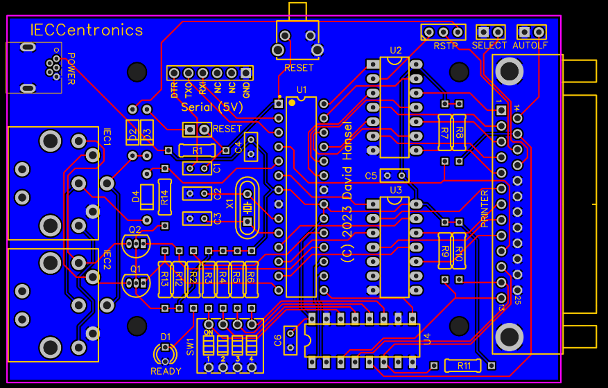
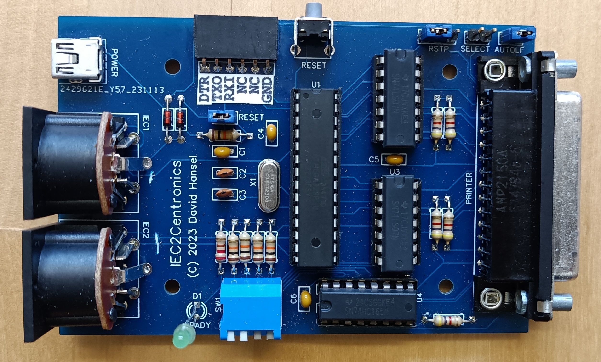
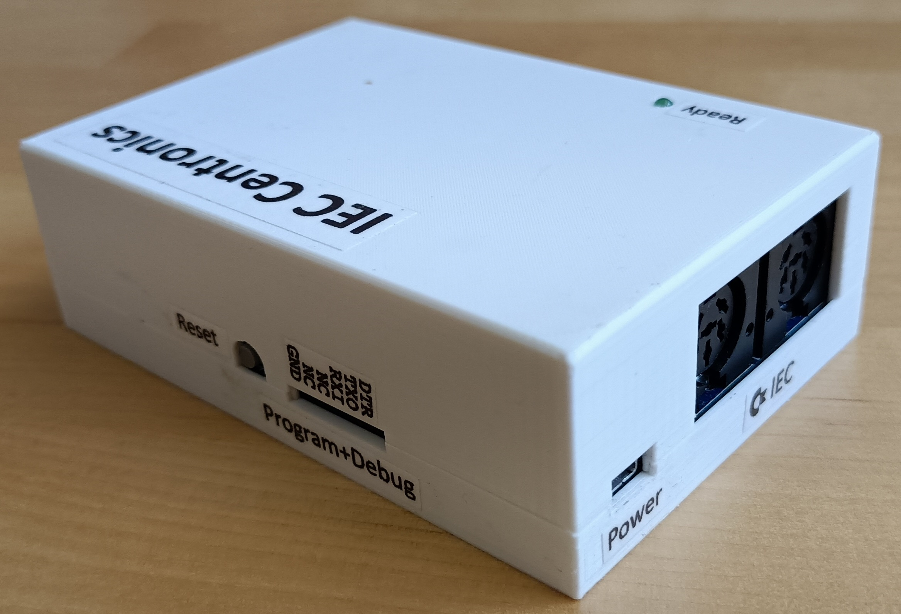
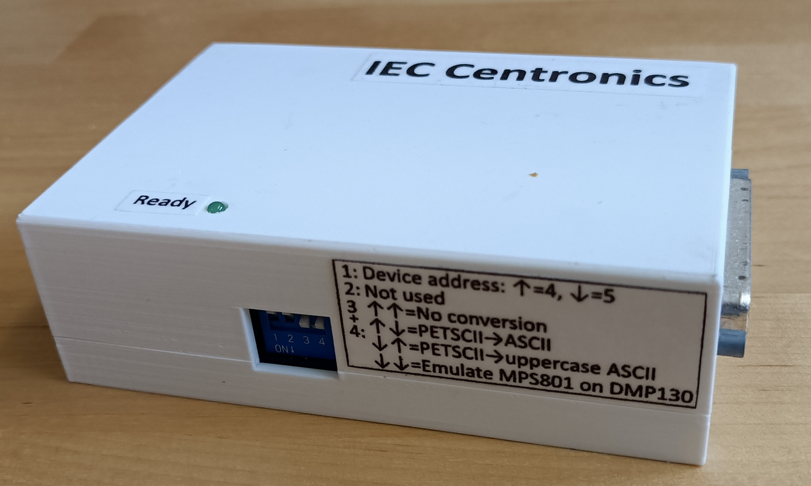

# Build instructions

To build an IECCentronics device, start by uploading the [Gerber](gerber.zip) file
to a PCB manufacturing company. A [BOM](bom.csv) listing all necessary parts including
manufacturer and DigiKey part numbers is also available. Refer to the
 [PCB layout](pcb.pdf) and [schematic](schematic.pdf) files for component placement.

   

Here is a picture of a completed PCB (note: there have been some changes to the PCB
since I took this picture):  
   

There are also STL files for 3d-printing a case ([top](CaseTop.stl), [bottom](CaseBottom.stl)):  

      

# Uploading the firmware

First make sure that the ATMega328p chip has an Arduino UNO bootloader installed. If not, there
are a number of instructions available on the net (google ["atmega328 burn boot loader"](https://www.google.com/search?client=firefox-b-1-d&q=atmega328+burn+boot+loader)).
Once the bootloader is installed, you can upload the firmware:
1) make sure the PCB is fully populated
2) connect a [USB-to-serial adapter](https://www.ebay.com/sch/i.html?_nkw=hiletgo+usb+serial+ftdi+adapter) to the "Serial (5v)" connector
3) connect USB power to the POWER connector
4) load the IECCentronics.ino sketch into the Arduino IDE
5) Select "Arduino UNO" as the board type
6) Select the proper serial port for your adapter
7) Click the "Upload Sketch" button
