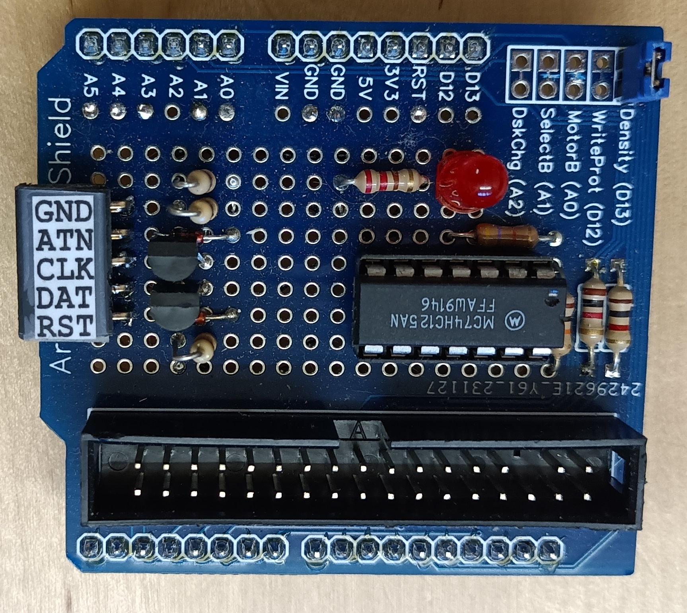

# IECFDC

This example combines the IECDevice library with my [ArduinoFDC library](https://github.com/dhansel/ArduinoFDC)
to connect PC-style disk dives (3.5" and 5.25") to a Commodore computer,
enabling the computer to read and write MFM disks. A JiffyDos enabled C64 can load a 202 block file 
from IECFDC in 12 seconds, the same speed as a JiffyDos enabled C1541 drive.

This example is specifically adapted to the limited resources in an Arduino UNO and therefore
has some limitations as to which operations are supported (see below). For a version
of this with more features see the [IECFDCMega](https://github.com/dhansel/IECDevice/tree/main/examples/IECFDCMega) example.

IEFDC supports the same disk drive types as [ArduinoFDC](https://github.com/dhansel/ArduinoFDC/blob/main/README.md#supported-diskdrive-types):
* 0: Double-density disk in a 5.25" double-density drive (360KB)
* 1: Double-density disk in a 5.25" high-density drive (360KB)
* 2: High-density disk in a 5.25" high-density drive (1.2MB)
* 3: Double-density disk in a 3.5" double- or high-density drive (720KB)
* 4: High-density disk in a 3.5" high-density drive (1.44MB)

By default type 4 is assumed. The drive type can be changed via the "XT=n" DOS command (see below)

Initially this device will show up as device #9 on the IEC bus. The device number can be changed
using the 'Xnn' command. For example, `OPEN 1,9,15,"X10!":CLOSE 1` will change the device number to 10.

## Wiring

To wire the disk drive I recommend using the [ArduinoFDC shield](https://github.com/dhansel/ArduinoFDC#arduinofdc-shields).
Due to the limited number of I/O pins on the Arduino Uno, this example uses the SelectB and MotorB
pins for other functions (only one disk drive is supported). Make sure to cut the traces for MotorB
and SelectB on the shield as described in the ArduinoFDC shield documentation.

The following table lists the IEC bus pin connections for this example (NC=not connected).

IEC Bus Pin | Signal   | Arduino Uno
------------|----------|------------
1           | SRQ      | NC         
2           | GND      | GND        
3           | ATN      | A5          
4           | CLK      | A4         
5           | DATA     | A3         
6           | RESET    | RST

The ArduinoFDC library disables interrupts while reading or writing the disk which can take several
milliseconds and can causes IEC bus timing issues as described in the 
[Timing Considerations](https://github.com/dhansel/IECDevice#timing-considerations) section of the IECDevice library.
Therefore this example code utilizes the hardware extension described in that section. Wire the 74LS125 IC 
up as described in that section onto the prototyping area on the ArduinoFDC shield. The CTRL pin must be
connected to the Arduino's "A1" pin.

To show disk drive activity and status (i.e. blinking to signal an error), wire an LED from the "A2" pin on 
the Arduino through a 150 Ohm resistor to GND.

Finally, you can wire the IEC bus RESET signal to the RST pin of the Arduino. Doing so will reset the
Arduino whenever the computer is reset.

Note that the IEC bus does supply 5V power so you will need to power
your device either from an external 5V supply or use the 5V output available on
the computer's user port, cassette port or expansion port.

Fully assembled IECFDC device:  

## Supported functionality and limitations

Fitting both the support for reading MFM floppy disks and the IEC protocol into the limited
flash and sdram memory of the Arduino Uno required some compromises regarding the supported 
functionality. The [IECFDCMega](https://github.com/dhansel/IECDevice/tree/main/examples/IECFDCMega) example
makes use of the Arduino MEGA 2560 to offer extended support.

IECFDC supports:
  - Listing directory via LOAD"$",9
  - Loading and saving files (LOAD and SAVE commands)
  - Reading and writing data via the OPEN/PRINT#/INPUT# BASIC commands
  - Reading the device status (channel 15)
  - Executing the following DOS commands via the command channel (channel 15, see below for details)
  - Fast data transfer using JiffyDos

Supported DOS commands:
  - `S:filename`: delete file filename (filename may contain "*" and "?" wildcards)
  - `R:newname=oldname`: rename file oldname to newname
  - `N:diskname,n`: format disk (n is ignored, interleave factor is fixed to 7)
  - `N:diskname`: delete all files on disk
  - `MD:dirname`: create a directory named dirname
  - `RD:dirname`: remove the directory named dirname
  - `CD:dirname`: change into sub-directory named dirname
  - `CD[left-arrow]`: change to parent sub-directory
  - `X` or `E`: query extended device status: next status channel read will return `02, T=n, 00, 00` where n is the current drive type.
  - `XT=n`: set disk drive type (n=0-4, see [above](#IECFDC))
  - `Xnn`: temporarily change device number (3 <= nn <= 15) 
  - `Xnn!`: permanently change device number (3 <= nn <= 15)
  - `I`: re-initialize disk
  - `U:` or `UJ`: reset

Limitations:
  - Only one file can be opened at a time
  - Only one disk drive supported
  - No long filename support (file names longer than 8 characters show up as abcdef~N)
  - No code page support (file names using characer codes >127 may show up incorrecly)
