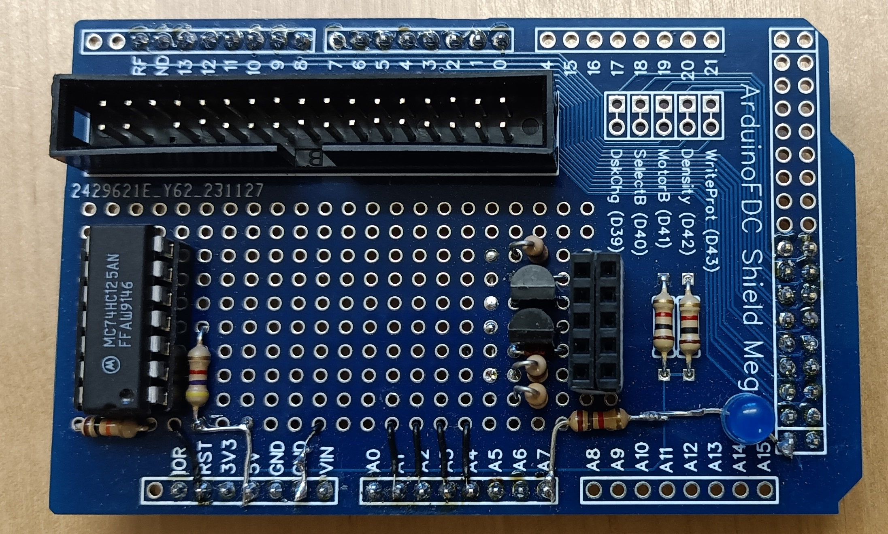

# IECFDCMega

This example combines the IECDevice library with my [ArduinoFDC library](https://github.com/dhansel/ArduinoFDC)
to connect PC-style disk dives (3.5" and 5.25") to a Commodore computer,
enabling the computer to read and write MFM disks. A JiffyDos enabled C64 can load a 202 block file 
from IECFDCMega in 12 seconds, the same speed as a JiffyDos enabled C1541 drive.

This is the bigger brother to the [IECFDC](https://github.com/dhansel/IECDevice/tree/main/examples/IECFDC) example.
The two are very similar but IECFDCMega fixes some of IECFDC's shortcomings by utilizing the bigger
memory space (SRAM and flash) as well as the larger number of pins available on the Arduino Mega 2560.

IEFDC supports the same disk drive types as [ArduinoFDC](https://github.com/dhansel/ArduinoFDC/blob/main/README.md#supported-diskdrive-types):
By default a 3" HD drive is assumed. The drive type can be changed via the "XT=n" or "XT=mnemonic" DOS command (see below).

Initially this device will show up as device #9 on the IEC bus. The device number can be changed
using the 'Xnn' command. For example, `OPEN 1,9,15,"X10!":CLOSE 1` will change the device number to 10.

## Wiring

To wire the disk drive I recommend using the [ArduinoFDC shield](https://github.com/dhansel/ArduinoFDC#arduinofdc-shields).

The following table lists the IEC bus pin connections for this example (NC=not connected).

IEC Bus Pin | Signal   | Arduino Mega
------------|----------|-------------
1           | SRQ      | NC         
2           | GND      | GND        
3           | ATN      | A3          
4           | CLK      | A2         
5           | DATA     | A1         
6           | RESET    | RST

The ArduinoFDC library disables interrupts while reading or writing the disk which can take several
milliseconds and can causes IEC bus timing issues as described in the 
[Timing Considerations](https://github.com/dhansel/IECDevice#timing-considerations) section of the IECDevice library.
Therefore this example code utilizes the hardware extension described in that section. Wire the 74LS125 IC 
up as described in that section onto the prototyping area on the ArduinoFDC shield. The CTRL pin must be
connected to the Arduino's "A4" pin.

To show disk drive activity and status (i.e. blinking to signal an error), wire an LED from the "A7" pin on 
the Arduino through a 150 Ohm resistor to GND.

Finally, you can wire the IEC bus RESET signal to the RST pin of the Arduino. Doing so will reset the
Arduino whenever the computer is reset.

Note that the IEC bus does supply 5V power so you will need to power
your device either from an external 5V supply or use the 5V output available on
the computer's user port, cassette port or expansion port.

Fully assembled IECFDCMega device:  
   

## Supported functionality

IECFDCMega supports:
  - Listing directory via LOAD"$",9
  - Loading and saving files (LOAD and SAVE commands)
  - Reading and writing data via the OPEN/PRINT#/INPUT# BASIC commands
  - Reading the device status (channel 15)
  - Executing the following DOS commands via the command channel (channel 15, see below for details)
  - Fast data transfer using JiffyDos
  - Dual disk drive support (prefix file names with "0:" or "1:" to select the drive)
  - Multiple files open at the same time
  - Long DOS file names (not limited to 8 characters)
  - Code page 437 (U.S.) is supported by default, supported code page can be changed in file ffconf.h

Supported DOS commands:
  - `S:filename`: delete file filename (filename may contain "*" and "?" wildcards)
  - `R:newname=oldname`: rename file oldname to newname
  - `R:newname`: change disk name
  - `C:newname=oldname`: copy file (allows copying between drives by specifying 0: and 1: prefix)
  - `N:diskname`: delete all files on disk
  - `N:diskname,n`: format disk using [interleave](https://en.wikipedia.org/wiki/Interleaving_(disk_storage)) factor n (if n=0 or not a digit then interleave is 7)
  - `MD:dirname`: create a directory named dirname
  - `RD:dirname`: remove the directory named dirname
  - `CD:dirname`: change into sub-directory named dirname
  - `CD[left-arrow]`: change to parent sub-directory
  - `X` or `E`: query extended device status
  - `XT=n`: set disk drive type (n=0-4, see below)
  - `XT=abc`: set disk drive type (abc=mnemonic, see below)
  - `XUn`: temporarily make drive n (0 or 1) the default drive
  - `XUn!`: permanently make drive n (0 or 1) the default drive
  - `Xnn`: temporarily change device number (3 <= nn <= 15) 
  - `Xnn!`: permanently change device number (3 <= nn <= 15)
  - `I`: re-initialize disk
  - `U:` or `UJ`: software reset

Reading the status channel after sending an "X" or "E" command produces the following output: `02, U=n:T0=mn:T1=mn` where
  - `U=n` shows the currently selected default drive unit
  - `T0=mn` shows the drive type for drive unit 0
  - `T1=mn` shows the drive type for drive unit 1

Supported disk drive types:

n | Mnemonic | Drive type
--|----------|-----------
0 | 5DD      | Double-density disk in a 5.25" double-density drive (360KB)
1 | 5DDHD    | Double-density disk in a 5.25" high-density drive (360KB)
2 | 5HD      | High-density disk in a 5.25" high-density drive (1.2MB)
3 | 3DD      | Double-density disk in a 3.5" double- or high-density drive (720KB)
4 | 3HD      | High-density disk in a 3.5" high-density drive (1.44MB)
