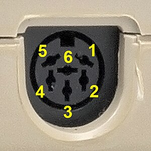

# IECBasicSerial

This example demonstrates how to implement a very basic IEC-to-serial converter using the IECDevice
class. It can be used to connect a microcontroller (e.g Arduino Uno) to the Commodore IEC bus and
communicate with the computer using a serial connection.

As is, this device will show up as device #4 on the IEC bus. The device number can be changed
by altering the `#define DEVICE_NUMBER 4` line in IECBasicSerial.ino.

## Wiring

The following table lists the pin connections for this example for different microcontrollers
(NC=not connected):

IEC Bus Pin | Signal   | Arduino Uno | Mega | Micro | Due | Raspberry Pi Pico | ESP32
------------|----------|-------------|------|-------|-----|-------------------|------
1           | SRQ      | NC          | NC   | NC    | NC  | NC                | NC 
2           | GND      | GND         | GND  | GND   | GND | GND               | GND
3           | ATN      | 3           | 3    | 3     | 3   | GPIO2             | IO34
4           | CLK      | 4           | 4    | 4     | 4   | GPIO3             | IO32
5           | DATA     | 5           | 5    | 5     | 5   | GPIO4             | IO33
6           | RESET    | NC          | NC   | NC    | NC  | NC                | NC 

When looking at the IEC bus connector at the back of your Commodore, the pins are as follows:  
   

As described in the Wiring section for the IECDevice library, controllers running
at 5V (Arduino Uno, Mega or Micro) can be connected directly to the IEC bus.
Controllers running at 3.3V (Arduino Due, Raspberry Pi Pico or ESP32) require a 
[voltage level converter](https://www.sparkfun.com/products/12009).

Note that the IEC bus does supply 5V power so you will need to power
your device either from an external 5V supply or use the 5V output available on
the computer's user port, cassette port or expansion port.

## Example BASIC program for communication

After programming your microcontroller and connecting it up to the IEC bus
you can run the following BASIC program on the computer to test the device:

```
10 OPEN 1,4
20 GET#1,A$:IF (ST AND 2)=0 THEN PRINT A$;
30 GET A$:IF A$<>"" THEN PRINT#1, A$;
40 GOTO 20
```
